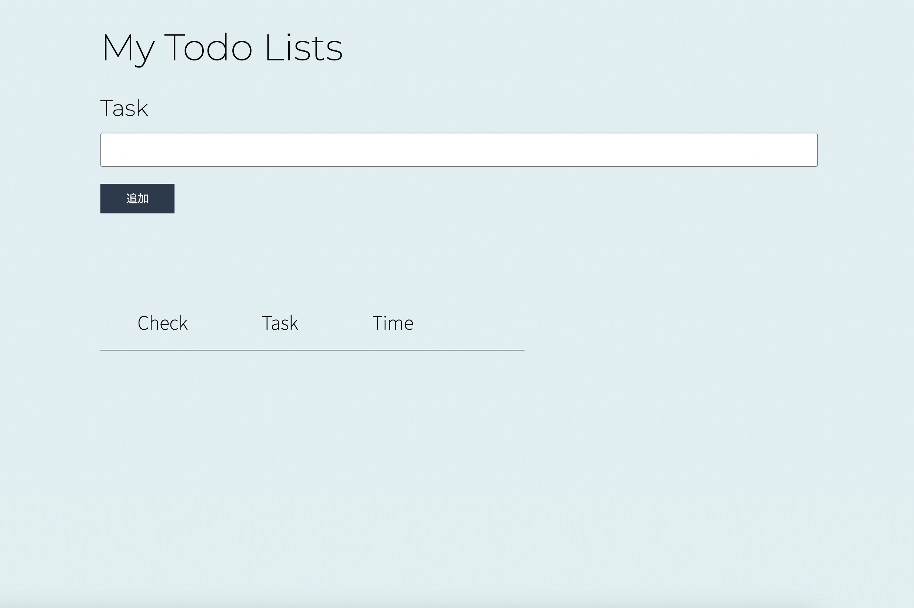

# portfolio3-ToDo
HTML , CSS  , PHP を使用して、タスク管理アプリを作成しました。 
 
実装した主な機能は以下の通りです。 
・タスク登録機能 
・タスク一覧表示機能 
・タスク削除機能 

## usage
【タスク登録機能】 
・パスワードなどの入力なしで、追加ボタンを押すだけで登録できます。

【タスク一覧表示機能】 
・チェックボックスがあるため、残っているタスクとやるべきことが明確になります。

【タスク削除機能】 
・パスワードなどの入力なしで、削除ボタンを押すだけで削除することができます。
